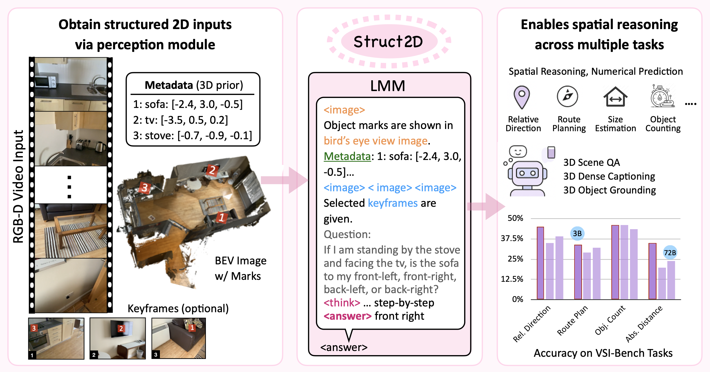

# Struct2D

Official code release for **Struct2D: A Perception-Guided Framework for Spatial Reasoning in Large Multimodal Models**.


[Fangrui Zhu<sup>*</sup>](https://fangruizhu.github.io/), [Hanhui Wang<sup>*</sup>](https://sarihust.github.io/), [Yiming Xie](https://ymingxie.github.io/), [Jing Gu](https://g-jing.github.io/), [Tianye Ding](https://jerrygcding.github.io/), [Jianwei Yang](https://jwyang.github.io/), [Huaizu Jiang](https://jianghz.me/)  
<sup>*</sup>Equal Contribution


📑 [Paper (arXiv)](https://arxiv.org/pdf/2506.04220)&nbsp;&nbsp;
[ Dataset and Models](https://huggingface.co/datasets/fangruiz/struct2d) 


<p align="center">
    
</p>

### Highlights
- We propose a perception-guided 2D prompting strategy, Struct2D Prompting, and conduct a
detailed zero-shot analysis that reveals LMMs’ ability to perform 3D spatial reasoning from
structured 2D inputs alone.
- We introduce Struct2D-Set, a large-scale instructional tuning dataset with automatically generated, fine-grained QA pairs covering eight spatial reasoning categories grounded in 3D scenes.
- We fine-tune an open-source LMM to achieve competitive performance across several spatial
reasoning benchmarks, validating the real-world applicability of our framework.

## 📁 Contents

1. [Zero-shot Analysis](zero-shot-prompting/README.md)
2. [Data Processing](data-processing/README.md)
3. [Training and Evaluation](scripts/README.md)

## Installation

```bash
conda create -n struct2d python=3.10 -y
conda activate struct2d
git clone git@github.com:neu-vi/struct2d.git
pip install -e ".[torch,metrics]" --no-build-isolation
```

## 📖 Citation

If you find Struct2D helpful in your research, please consider citing:

```bibtex
@article{zhu2025struct2d,
  title={Struct2D: A Perception-Guided Framework for Spatial Reasoning in Large Multimodal Models},
  author={Zhu, Fangrui and Wang, Hanhui and Xie, Yiming and Gu, Jing and Ding, Tianye and Yang, Jianwei and Jiang, Huaizu},
  journal={arXiv preprint arXiv:2506.04220},
  year={2025}
}
```

## 🙏 Acknowledgement

We thank the authors of [GPT4Scene](https://gpt4scene.github.io/), [LLaMA-Factory](https://github.com/hiyouga/LLaMA-Factory) for inspiring discussions and open-sourcing their codebases. 